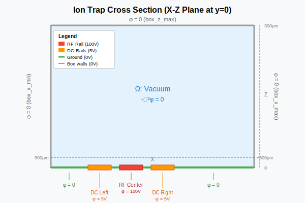
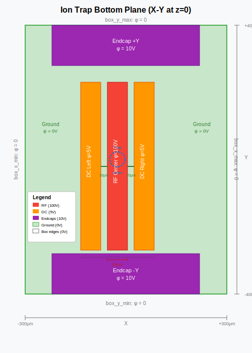

# Claude Demo for a simple 3D trap: Solves Laplace Equation in 3D

---


**Summary of all specification files:**

| File | Purpose |
|------|---------|
| CLAUDE.md | Main spec with code requirements and unit tests |
| specs/problem.yaml | PDE and boundary condition mapping |
| specs/geometry.yaml | Ion trap geometry definition |
| specs/solver.yaml | Tool paths and PETSc settings |
| specs/input.yaml | Runtime config (mesh, output, voltages) |
| Claude Code Prompt | Kickoff and follow-up prompts |


## Boundary condition schematics



**Running:**
```bash
cd tests && make test
```

**Test meshes:**
- `single_tet.msh` — Minimal mesh for unit tests
- `unit_cube.msh` — Standard validation geometry

**Test files:**
| File | Tests |
|------|-------|
| `test_mesh_io.c` | Mesh reading, physical groups, error handling |
| `test_assembly.c` | Shape gradients, element volume, stiffness matrix properties |
| `test_boundary.c` | Dirichlet application, boundary node identification |
| `test_solver.c` | PETSc setup, matrix assembly, basic solves |
| `test_integration.c` | Full solve on unit cube, convergence study, output validation |

**Key validation tests:**
- Linear solution test (φ=z for cube with φ=0 at bottom, φ=1 at top)
- Convergence order verification (expect O(h²) for P1 elements)
- Output format validation (CSV readable, VTK valid)

## Kickoff Prompt
```
Read CLAUDE.md and build the 3D Poisson FEM solver:

1. Create directory structure
2. Copy spec files (problem.yaml, geometry.yaml, solver.yaml, input.yaml)
3. Generate Gmsh .geo script from geometry.yaml with physical groups for all surfaces
4. Implement C solver that reads electrode voltages from input.yaml at runtime
5. Create Makefile
6. Create unit tests with test meshes
7. Create Python postprocessing script for slice extraction

Pause after each step for review.
```

## Prerequisites
```
Check for: mpicc, gmsh, PETSc (PETSC_DIR), Python (numpy, matplotlib, meshio).
```

## Run Tests
```
Build and run all unit tests. Report pass/fail for each test.
```

## Generate Geometry Only
```
Read specs/geometry.yaml and generate mesh/domain.geo. Use OpenCASCADE, create box domain, imprint electrode patches with BooleanFragments, assign physical groups for each electrode and outer walls.
```

## Mesh and Solve
```
Run gmsh -3 mesh/domain.geo to generate tetrahedral mesh. Compile solver. Run with: ./solver specs/input.yaml
```

## Visualize
```
Create extract_slice.py to read output/solution.vtk, extract a horizontal slice at z=50e-6, and plot potential contours.
```
